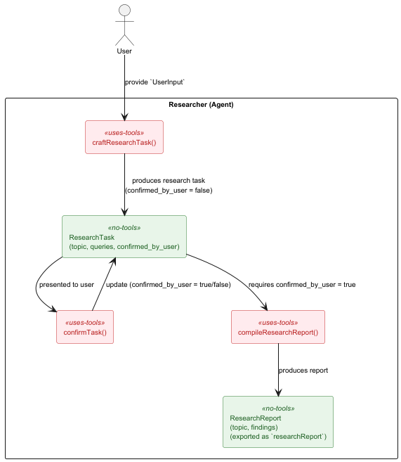

# Deep Research Agent

This is a simple implementation of a deep web research agent using Embabel and Spring Shell.
Here is a diagram of how the agent works:



Embabel is a unique framework in the way workflows are constructed in comparison with other frameworks.

The researcher agent has the following methods:
- `craftResearchTask` : creates an initial set of tasks, to be confirmed by the user later.
  - Preconditions: `UserInput` must exist (aka. this is the initial method that gets called)
  - Postcondition: `ResearchTask` is created (to be used by subsequent methods)
- `confirmTask` : refines the tasks based on user feedback, until user is satisfied.
  - Preconditions: `ResearchTask` must exist
  - Postcondition: `confirmed_by_user` must be true. (meaning the agent will repeatedly call this method until user is satisfied)
- `compileResearchProject` : compiles the research project into a final report (markdown syntax)
  - Preconditions: `ResearchTask` must exist *and* `confirmed_by_user` is true
  - Postcondition: `ResearchReport` is created *and* `exported` to the user (logged to the shell and the goal is achieved.)
  - Temperature: set to a lower value to reduce randomness.

The framework, automatically figures out the dependencies between these methods based on their preconditions and postconditions,
and constructs a workflow to achieve the final goal of producing a research report.

LLMs used:
- `gpt-4.1-mini`: used for crafting research tasks and refining them based on user feedback.
- `gpt-4.1`: used for compiling the final research report.

# Running

Run the shell script to start Embabel under Spring Shell:

```bash
./scripts/shell.sh
```


When the Embabel shell comes up, invoke the research agent like this:

```
x "Perform deep research on the impact of climate change on global agriculture and provide a comprehensive report."
```


